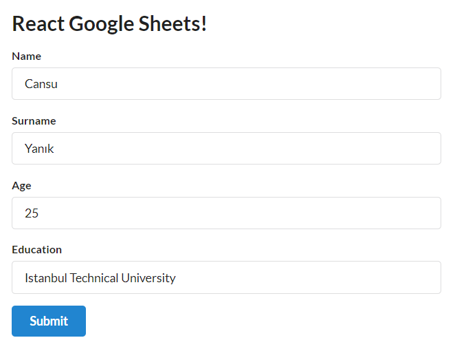
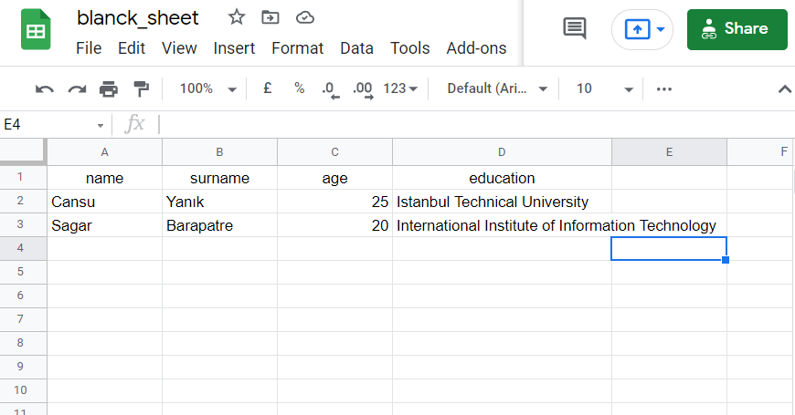

# Web-Development
Web development studies

## My Personal Website

Click to visit the website (still in progress) -> https://personal-website-edd19.web.app/

## Turn Google Sheets into a REST API and Use it with a React Application

  
  =>
  

